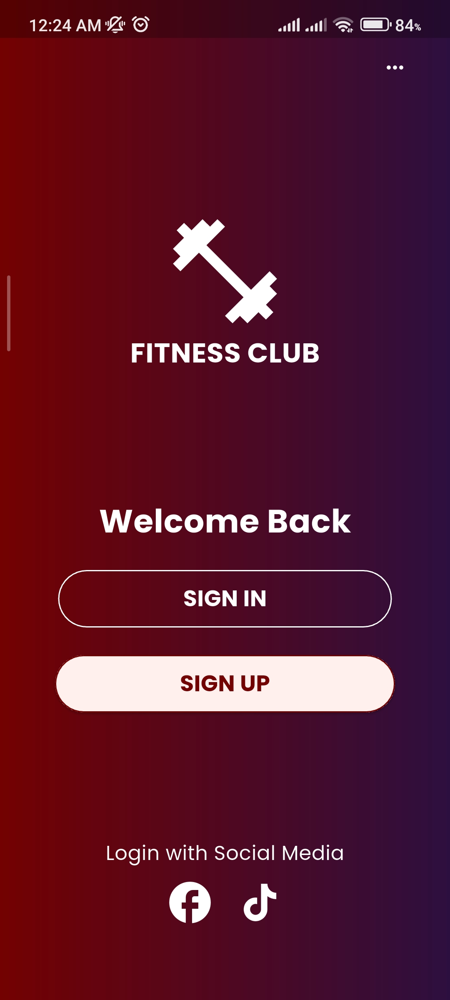
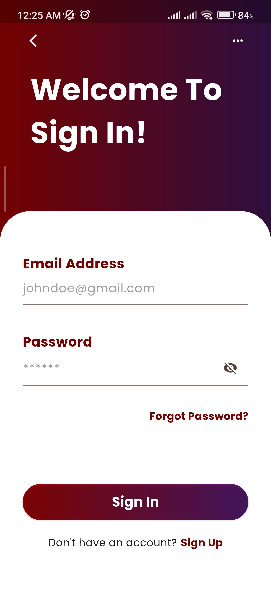
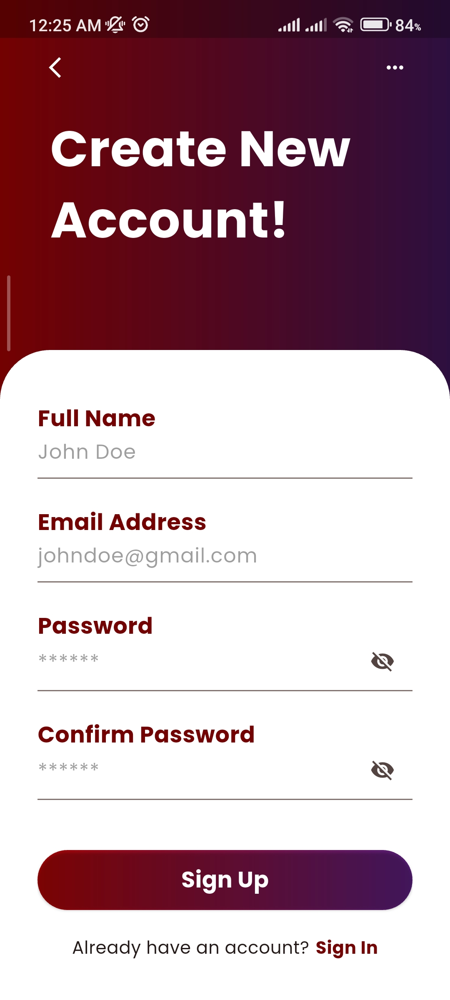

# 🏋️ Fitness Login App (Flutter)

A modern Flutter-based authentication UI application designed for a Fitness Club concept. The app includes clean UI screens with form validation, navigation flow, and local storage using SharedPreferences.

---

## 🎯 Project Overview

This application contains three main screens:

1. Welcome Screen (Sign In / Sign Up selection)  
2. Sign In Screen  
3. Sign Up Screen  

The focus of this project is on UI design, form validation, and simple local state persistence.

---

## 🚀 Features

- Beautiful gradient background UI
- Fitness Club branded welcome screen
- Sign In & Sign Up screen navigation
- Form validation (required fields check)
- Email & password validation
- Error handling for empty inputs
- Local storage using SharedPreferences
- Clean and responsive UI design

---

## 📸 Screenshots

### 🏋️ Welcome Screen


### 🔐 Sign In Screen


### 📝 Sign Up Screen


---

## 🛠️ Tech Stack

- Flutter
- Dart
- Material Design
- SharedPreferences (Local Storage)

---

## ⚙️ Functional Flow

1. User opens app → Welcome screen appears  
2. User selects Sign In or Sign Up  
3. Form validation checks required fields  
4. If valid → user data stored using SharedPreferences  
5. Navigation proceeds based on input validation  

---

## 🧠 Key Concepts Used

- Multi-screen navigation
- Form validation in Flutter
- TextFormField validation logic
- SharedPreferences for local storage
- UI design with gradients
- State management (basic setState)

---

## 📂 Project Structure


lib/
├── main.dart
├── screens/
│ ├── welcome_screen.dart
│ ├── signin_screen.dart
│ └── signup_screen.dart


---

## 📱 How to Run

Clone the repository:

```bash
git clone https://github.com/your-username/flutter-fitness-login-app.git

Navigate to project folder:
cd flutter-fitness-login-app

Install dependencies:
flutter pub get

Run the app:
flutter run
```
## 🎯 Future Improvements

- Add Firebase Authentication
- Add password reset functionality
- Improve animations and transitions
- Add biometric login (fingerprint / face ID)
- Connect to real backend API

---
## 👨‍💻 Author

Umar
Flutter Developer | BSCS Student
